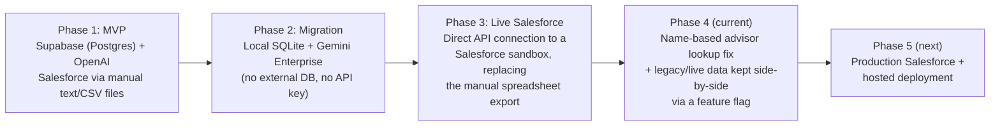
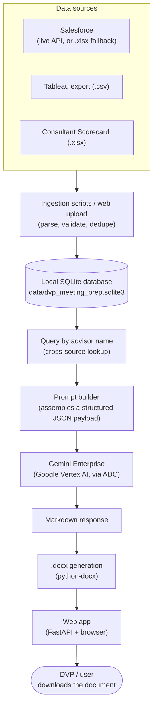
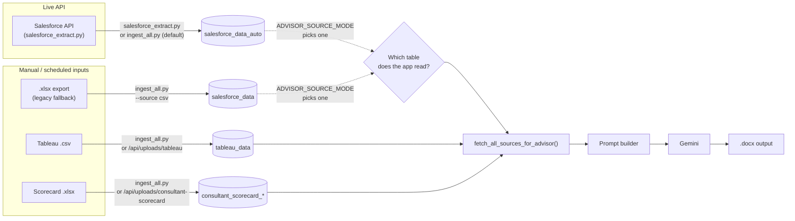
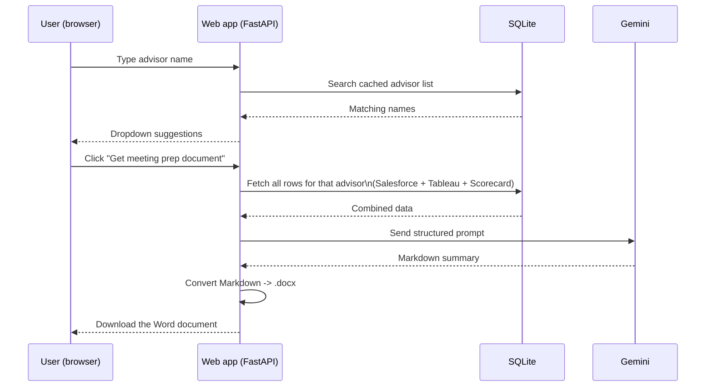
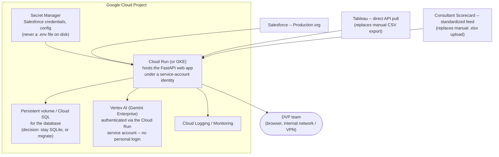

# DVP Meeting Prep — Project Handbook

> **Format note:** this file is written in standard Markdown (headings, tables,
> code fences, Mermaid diagrams) so it can be pasted directly into Confluence's
> Markdown editor/importer — headings, tables, links, code blocks, and
> ```mermaid``` fences all convert cleanly. If your Confluence site doesn't
> have Mermaid rendering enabled, diagrams will show as plain code blocks;
> ask your Confluence admin about the "Markdown" or "Mermaid" macro to enable
> native rendering, or re-paste each diagram block into a Mermaid macro
> manually.

| | |
|---|---|
| **Project** | DVP Meeting Prep |
| **Repository** | **[github.com/lukhsaankumar/DVPAgent](https://github.com/lukhsaankumar/DVPAgent)** |
| **Status** | Working sandbox proof-of-concept — not yet production-deployed |
| **Owner** | Lukhsaan Kumar ([lukhsaankumar@gmail.com](mailto:lukhsaankumar@gmail.com)) |
| **Last updated** | 2026-08-20 |
| **Audience** | Both technical (engineers/IT) and non-technical (business/DVP team) readers — see the [Glossary](#glossary) if a term is unfamiliar |

---

## Table of contents

1. [Executive summary](#executive-summary)
2. [Quick status snapshot](#quick-status-snapshot)
3. [How the project got here](#how-the-project-got-here)
4. [Architecture overview](#architecture-overview)
5. [Data sources: current state vs. production target](#data-sources-current-state-vs-production-target)
6. [Local / sandbox setup guide](#local--sandbox-setup-guide)
7. [Environment variable reference](#environment-variable-reference)
8. [Scripts reference](#scripts-reference)
9. [Ingestion & data flow pipeline](#ingestion--data-flow-pipeline)
10. [Database schema reference](#database-schema-reference)
11. [The web application](#the-web-application)
12. [Testing](#testing)
13. [Production readiness: GCP-native target architecture](#production-readiness-gcp-native-target-architecture)
14. [Before production: migration checklist](#before-production-migration-checklist)
15. [Glossary](#glossary)

---

## Executive summary

**What this is:** An internal tool that automatically prepares briefing
documents for DVP (District Vice President) meetings with financial
advisors. Instead of someone manually pulling data from three different
systems — Salesforce (client activity), Tableau (business performance
dashboards), and a Consultant Scorecard spreadsheet (advisor metrics) — this
tool pulls all three automatically, hands them to Google's Gemini AI, and
produces a formatted, downloadable Word document summarizing everything a
DVP needs to know before meeting with a given advisor.

**Where it stands today:** The tool works end-to-end against a Salesforce
**sandbox** (test) environment, with real Tableau and Consultant Scorecard
data. A person can open a web page, search for an advisor by name, click a
button, and get a Word document a few seconds later. This has been verified
working, including with real (not dummy/sample) source data.

**What's left before it can be used with real production Salesforce data
and deployed for the team to use day-to-day:** see
[Before production: migration checklist](#before-production-migration-checklist).
Nothing described there is a redesign — it's connecting the same working
pipeline to production systems instead of sandbox/manual ones, plus normal
hosting/security hardening.

---

## Quick status snapshot

| Component | Status | Notes |
|---|---|---|
| Salesforce data (live) | ✅ Working (sandbox) | ⚠️ Not yet pointed at production org |
| Salesforce data (legacy manual export) | ✅ Working, kept as fallback | Still supported side-by-side |
| Tableau data | ✅ Working | ⚠️ Manual CSV upload only — no direct API pull yet |
| Consultant Scorecard data | ✅ Working | ⚠️ Manual `.xlsx` upload, workbook format not standardized at the source |
| SQLite database | ✅ Working | ⚠️ Single-file, single-writer — fine for POC/small team, needs a decision before wider rollout (see [checklist](#before-production-migration-checklist)) |
| Gemini AI document generation | ✅ Working | Uses developer's personal Google login (ADC) locally — must switch to a service identity in production |
| Web app (search + download) | ✅ Working | Runs on a developer's laptop — not hosted anywhere yet |
| Automated tests | ✅ 190/190 passing | Playwright browser end-to-end test exists but isn't run automatically |
| Hosting / deployment | ❌ Not started | See [Production readiness](#production-readiness-gcp-native-target-architecture) |

---

## How the project got here

This project went through three architectures on the way to its current
form. Understanding this history explains a few things that might otherwise
look odd in the code (e.g. two Salesforce tables, a `plan.md` file that
describes a different database than the one actually used).



1. **Original plan (`plan.md`, historical):** a small proof-of-concept using
   Supabase (hosted Postgres) as the database and OpenAI as the LLM, with all
   three data sources provided as manually-exported files.
2. **Migration to SQLite + Gemini Enterprise:** Supabase was replaced with a
   local SQLite file (no server, no account, no network dependency for the
   database itself) and OpenAI was replaced with Google's Gemini Enterprise,
   authenticated via Google Application Default Credentials (ADC) instead of
   an API key. See `docs/TESTING_GEMINI_SQLITE_MIGRATION.md` for the full
   record of that migration.
3. **Live Salesforce integration:** the manually-exported Salesforce
   spreadsheet was replaced with a direct, live connection to a Salesforce
   sandbox using the `simple-salesforce` library. See
   `docs/SALESFORCE_SETUP.md`.
4. **Name-based advisor lookup (most recent fix):** the live Salesforce
   integration was originally built to look advisors up by an "advisor
   number" field. Investigation found that field is not reliably populated
   on real advisor records in the sandbox, so real advisors were silently
   invisible to the tool even though their data existed. The lookup was
   generalized to select advisors by any configured field (defaulting to
   the number field, but set to `Name` in the sandbox) — this is now
   verified working with 5 real advisors' real data. The **legacy**
   (manually-exported) and **live/auto** (Salesforce API) data are kept in
   two separate database tables with a feature flag to choose which one the
   app reads from, so this change never risked breaking the already-working
   manual-export path.

---

## Architecture overview



**In plain terms:** three different systems hold pieces of information about
an advisor. This tool pulls all three into one place (a local database),
looks up everything known about one advisor when asked, asks an AI model to
turn that into a readable summary, and converts the AI's answer into a Word
document the user can download and bring into their meeting.

**Two ways to use it:**
- **Web app** (recommended, day-to-day use): search for an advisor in a
  browser, click a button, download a `.docx` file.
- **CLI scripts**: terminal commands for bulk data loading and scripted/
  automated use (e.g. a scheduled nightly ingestion job).

---

## Data sources: current state vs. production target

| Source | Current state | Production target |
|---|---|---|
| **Salesforce** | Live connection to a **sandbox** org (`igdigitalplatform--ahackathon`). Verified working with real advisor data using name-based lookup. A local `.xlsx` export remains supported as a fallback/legacy path. | Point the same live-connection code at the **production** Salesforce org — new credentials, re-run field discovery (`--discover-salesforce`) since field names aren't guaranteed to match sandbox, confirm whether production's advisor-number field is reliably populated (sandbox's isn't) or whether name-based lookup is needed there too. **No code changes expected** — this is a configuration/credentials cutover. See [checklist](#before-production-migration-checklist). |
| **Tableau** | A person manually exports a `.csv` from Tableau and uploads it through the web app's Upload page. Re-uploading is safe (duplicate rows are automatically skipped). | Replace the manual export/upload step with a **direct, scheduled pull** from Tableau's REST/Metadata API (or a scheduled export-and-drop into a watched location), so the data refreshes automatically instead of depending on someone remembering to export and upload it. This is the single biggest manual-process risk in the current pipeline. |
| **Consultant Scorecard** | A person manually uploads an `.xlsx` workbook through the web app's Upload page. The parser handles a specific (somewhat fragile) multi-header-row layout that matches the current sample file. | **Standardize the workbook format at the source** (whoever produces this report) so the parser isn't dependent on a specific header-row layout that could silently change. Longer-term, replace the manual upload with a direct feed/API from wherever this report is generated, the same way Salesforce was upgraded from a manual export to a live connection. |

> **Note:** None of the above requires re-architecting the database or the
> AI-generation step — those are already source-agnostic. Only the
> ingestion step for Tableau and Consultant Scorecard needs to change.

---

## Local / sandbox setup guide

This is the exact sequence to get the project running from scratch on a new
machine. (Condensed from `README.md`, which has the fully detailed version
including troubleshooting — treat that as the canonical step-by-step
reference and this as the summary.)

```powershell
# 1. Clone the repo
git clone https://github.com/lukhsaankumar/DVPAgent.git
cd DVPAgent

# 2. Create/activate a virtual environment, install dependencies
python -m venv .venv
.venv\Scripts\Activate.ps1
pip install -r requirements.txt
# (optional, only needed for the Playwright browser test:)
pip install -r requirements-dev.txt

# 3. Copy the env template and fill in real values
copy .env.sandbox.example .env.sandbox
# edit .env.sandbox: Salesforce credentials, GCP project, etc.

# 4. Authenticate to Google Cloud (one-time, interactive)
.\scripts\setup_google_auth.ps1

# 5. Initialize the local SQLite database (safe to rerun; never deletes data)
python scripts\init_sqlite.py
python scripts\check_sqlite_tables.py

# 6. Load data
python scripts\salesforce_extract.py      # live Salesforce -> salesforce_data_auto
python scripts\ingest_all.py              # Tableau + Consultant Scorecard (+ legacy Salesforce if DATA_SOURCE=csv)

# 7. Run the tests
python -m pytest tests\ -q

# 8. Start the web app
python scripts\run_server.py
# open http://127.0.0.1:8000
```

Requirements: **Python 3.12+**, a Google Cloud project with the Vertex AI
API enabled, and Salesforce sandbox credentials. No database server, no
Docker, and no API key are required to run this locally — SQLite is a plain
file and Gemini authentication uses your Google login (ADC), not a key.

A Docker-based setup is also available (`docker compose up --build`) — see
`README.md` section 4 for the full walkthrough; it's an alternative to the
venv setup above, not a different architecture.

---

## Environment variable reference

All configuration is via environment variables, loaded from a `.env` file
(the exact file depends on `APP_ENV` — see below). **Full detail with every
default and every Salesforce field-mapping option lives in
`docs/SALESFORCE_SETUP.md` and the `.env.*.example` files in the repo** —
this table is the condensed "what does each group control" reference.

### Which file gets loaded

| Variable | Meaning |
|---|---|
| `APP_ENV` | `sandbox` \| `production` \| `custom` — selects the Salesforce auth domain (test vs. login vs. custom) and, by convention, which `.env.<APP_ENV>` file loads |
| `ENV_FILE` | Explicit override — set this to load a specific file regardless of `APP_ENV` |

### Database

| Variable | Default | Meaning |
|---|---|---|
| `DATABASE_BACKEND` | `sqlite` | Only supported value today |
| `SQLITE_DB_PATH` | `data/dvp_meeting_prep.sqlite3` | Resolved relative to the project root |
| `SQLITE_JOURNAL_MODE` | `WAL` | Write-Ahead Logging — allows concurrent reads during a write |
| `SQLITE_BUSY_TIMEOUT_MS` | `10000` | How long to wait on a locked database before failing |

### Gemini / AI generation

| Variable | Meaning |
|---|---|
| `LLM_PROVIDER` | Only `gemini_enterprise` is supported |
| `GOOGLE_CLOUD_PROJECT` | The GCP project Gemini calls bill/authenticate against |
| `GOOGLE_CLOUD_LOCATION` | e.g. `us-central1` |
| `GOOGLE_GENAI_MODEL` | e.g. `gemini-2.0-flash-001` |
| `GOOGLE_GENAI_TEMPERATURE`, `_MAX_OUTPUT_TOKENS`, `_REQUEST_TIMEOUT_SECONDS`, `_MAX_RETRIES` | Standard generation/reliability tuning |
| `STORE_LLM_AUDIT_CONTENT` | Whether the full prompt/response is saved to the database for audit purposes |

### Data source selection

| Variable | Default | Meaning |
|---|---|---|
| `DATA_SOURCE` | `salesforce` | `salesforce` (live API) or `csv` (local `.xlsx` fallback) |
| `ADVISOR_SOURCE_MODE` | `legacy` | `legacy` (reads the manually-exported table) or `auto` (reads the live-extraction table) — this is the feature flag described in [How the project got here](#how-the-project-got-here); can also be set per-run with `--advisor-source` |
| `CSV_INPUT_PATH` | *(sample file)* | Only used when `DATA_SOURCE=csv` |

### Salesforce (see `docs/SALESFORCE_SETUP.md` for the complete list)

| Variable | Meaning |
|---|---|
| `SF_AUTH_MODE`, `SF_USERNAME`, `SF_PASSWORD`, `SF_SECURITY_TOKEN` | Credentials (password-flow auth) |
| `SF_ADVISOR_OBJECT` | Which Salesforce object represents an advisor/practice (currently `Account`) |
| `SF_ADVISOR_NUMBER_FIELD` | The "advisor number" field, used best-effort to populate the output — no longer required to be populated |
| `SF_ADVISOR_LOOKUP_FIELD` / `SF_ADVISOR_LOOKUP_VALUES` | **Which field actually selects advisors**, and the values to match. Defaults to the number field/numbers above; set to `Name` (as done in sandbox) when the number field isn't reliably populated |
| `SF_TASK_SUBJECTS` | Which Task types count as advisor interactions (`Call`, `Virtual Meeting`) |
| `SF_EXPECTED_ADVISOR_COUNT` / `_TASK_COUNT` / `_OPPORTUNITY_COUNT` | Sanity-check counts, logged as a warning (not an error) if actuals differ |
| `SF_STRICT_EXPECTED_COUNTS` | If `true`, a count mismatch stops the extraction instead of just warning — **recommended to enable in production** once real counts are known |

---

## Scripts reference

All scripts live in `scripts/` and are run with `python scripts\<name>.py`.

### Setup (run once per machine)

| Script | Purpose |
|---|---|
| `setup_google_auth.ps1` / `.sh` | One-time Google login for local Gemini access (skips if already logged in) |
| `setup_sqlite.ps1` / `.sh` | Creates the database file and verifies it — wraps `init_sqlite.py` + `check_sqlite_tables.py` |
| `init_sqlite.py` | Creates/updates the database schema. Safe to run repeatedly — never deletes data |
| `check_google_auth.py` | Confirms Gemini/Google auth is configured correctly. Add `--live --yes-i-want-to-call-gemini` to actually test a real (billed) call |
| `check_sqlite_tables.py` | Read-only health check — confirms tables/indexes exist, prints row counts per table |

### Ingestion (run whenever data needs refreshing)

| Script | Reads | Writes to | Notes |
|---|---|---|---|
| `ingest_all.py` | Salesforce `.xlsx` (or live API), Tableau `.csv`, Consultant Scorecard `.xlsx` | `salesforce_data` or `salesforce_data_auto`, `tableau_data`, `consultant_scorecard_*` | The bulk "load everything" command. `--append` to add instead of replace |
| `salesforce_extract.py` | Live Salesforce API only | `salesforce_data_auto` only | `--discover-salesforce` to find field names on a new org; `--dry-run` to validate without writing |

### Query / generation (CLI alternative to the web app)

| Script | Purpose |
|---|---|
| `query_advisor.py "Name"` | Prints raw rows from every source table for one advisor — useful for debugging |
| `run_meeting_prep.py "Name" --save out.md` | Generates and saves a Markdown meeting-prep document directly, no prompts |
| `interactive_meeting_prep.py` | Guided terminal flow — pick an advisor, preview the AI prompt, optionally generate |
| `run_server.py` | Starts the web app. `--advisor-source {legacy,auto}` picks which Salesforce table the app reads from for this run |

### Diagnostics (Salesforce-specific, used when setting up a new org)

| Script | Purpose |
|---|---|
| `compare_salesforce_sources.py legacy_file.xlsx` | Compares every live Salesforce advisor record against a legacy spreadsheet to find overlap — useful for confirming which advisors are "real" in a new org |
| `find_advisor_number_field.py legacy_file.xlsx` | Tests candidate Salesforce fields against known advisor numbers to find the right join key |
| `inspect_advisor_records.py` | Pulls a named advisor's full record (and related User record) and searches every field for an expected value — used to diagnose exactly the "advisor number not populated" issue this project ran into in sandbox |

---

## Ingestion & data flow pipeline



**Key point:** `salesforce_data` (legacy, manually exported) and
`salesforce_data_auto` (live API) are two separate tables holding the same
row shape. The app reads from whichever one `ADVISOR_SOURCE_MODE` points at,
but always presents it to the rest of the code under one stable name — so
switching modes never requires touching the AI-generation code. Tableau and
Consultant Scorecard data show up regardless of which Salesforce mode is
active, since an advisor can have data in those sources even without
Salesforce data.

---

## Database schema reference

Everything lives in one SQLite file. Tables are created/updated by
`sql/schema.sql` and versioned migrations in `sql/migrations/`.

| Table | Purpose | Populated by |
|---|---|---|
| `salesforce_data` | One row per advisor Task — **legacy**, manually-exported spreadsheet | `ingest_all.py` (`DATA_SOURCE=csv`) |
| `salesforce_data_auto` | Same shape, from the **live** Salesforce API | `salesforce_extract.py`, `ingest_all.py` (default) |
| `tableau_data` | One row per Tableau export line | `ingest_all.py`, or the web app's Upload page |
| `consultant_scorecard_raw` | Audit copy of every row in the uploaded workbook | same |
| `consultant_scorecard_monthly` | One row per advisor per reporting month — the version actually used for meeting prep | same, upserted by (report date, advisor number) |
| `consultant_scorecard_metric` | Individual metric values linked to a monthly row | same, re-derived per upload |
| `consultant_scorecard_data` | Legacy flat mirror, kept for inspection only — **not used by meeting-prep generation** | `ingest_all.py` only |
| `upload_batches` | Audit log of every file uploaded through the web app (rows parsed/inserted/skipped, success/error) | web app upload endpoints |
| `meeting_prep_documents` | Audit log of every generated document (prompt + response text, if `STORE_LLM_AUDIT_CONTENT=true`) | web app generation endpoint |
| `schema_migrations` | Tracks which migrations have been applied | migration runner |

There is **no destructive command anywhere in the app** — nothing can drop a
table or delete a row outside of manually running SQL against the file
directly. Re-running any ingestion script is always safe.

---

## The web application



Two pages, no build step, no JavaScript framework — plain HTML/CSS/JS served
directly:

- **Home page (`/`)** — search-as-you-type advisor lookup, then a button to
  generate and download the meeting prep `.docx`.
- **Upload page (`/upload`)** — drag-and-drop upload for Tableau `.csv`
  exports and Consultant Scorecard `.xlsx` workbooks. Salesforce is
  intentionally **not** uploadable here — it syncs live from the API
  instead. Re-uploading a file (even the exact same one) never creates
  duplicate rows.

---

## Testing

```powershell
python -m pytest tests\ -q
```

190 tests, all mocked (no live Google or Salesforce calls, no real network
access needed) — covers ingestion, database migrations, cross-source
matching, the Salesforce extraction pipeline (including the recent
name-based lookup fix), Gemini client behavior, and the web API. This is
run before every change described in this document.

A separate **real-browser** end-to-end test
(`tests/e2e_smoke_test.py`, uses Playwright) exists but is excluded from the
default `pytest` run (it needs `requirements-dev.txt` and a running server)
— **this should be run manually at least once before production go-live**,
since it's the only test that actually drives the app through a real
browser rather than mocked HTTP calls.

---

## Production readiness: GCP-native target architecture

Everything below describes the **target state** — what changes when moving
from "runs on a developer's laptop against a sandbox" to "hosted, used by
the team, against production data." None of it requires changing the core
application logic; it's hosting, identity, and configuration.



**What's different from local/sandbox:**

| Aspect | Local / sandbox today | Production target |
|---|---|---|
| Hosting | Developer's laptop, `python scripts/run_server.py` | Cloud Run (or GKE), behind normal GCP networking/access controls |
| Gemini auth | Developer's personal Google login (ADC) | A **Cloud Run/GKE service account** with the Vertex AI IAM role — `google.auth.default()` picks this up automatically with zero code changes, per `README.md`'s existing guidance |
| Secrets (Salesforce credentials, etc.) | Plaintext `.env.sandbox` file on disk, gitignored | **Secret Manager**, injected as environment variables at deploy time — never a file on disk in the container |
| Salesforce org | Sandbox (`igdigitalplatform--ahackathon`) | Production org — new credentials, re-run `--discover-salesforce`, confirm the advisor-lookup field |
| Database | Single SQLite file on the laptop | Decision needed: a persistent disk/volume mounted into Cloud Run (simplest, keeps SQLite) vs. migrating to a managed database (only needed if multiple instances must write concurrently — SQLite is single-writer by design) |
| Tableau data | Manual CSV export + upload | Direct scheduled API pull |
| Consultant Scorecard data | Manual `.xlsx` upload | Standardized feed/template, ideally automated |
| Monitoring | Terminal output only | Cloud Logging + Cloud Monitoring, alerting on failed generations/ingestions |
| Validation strictness | `SF_STRICT_EXPECTED_COUNTS=false` (warns only) | Consider `true` once real production counts are known, so silent data gaps become loud failures |

---

## Before production: migration checklist

Grouped by area, roughly in priority order. None of these are code
rewrites — they're configuration, process, and infrastructure work on top
of the already-working pipeline.

### Salesforce
- [ ] Obtain production Salesforce credentials (separate from sandbox).
- [ ] Run `python scripts/salesforce_extract.py --discover-salesforce` against production to confirm object/field API names match the sandbox assumptions (they may not).
- [ ] Confirm whether production's advisor-number field is populated reliably, or whether `SF_ADVISOR_LOOKUP_FIELD=Name` (the sandbox fix) is needed there too.
- [ ] Update `SF_EXPECTED_ADVISOR_COUNT` / `_TASK_COUNT` / `_OPPORTUNITY_COUNT` to real production numbers, then consider enabling `SF_STRICT_EXPECTED_COUNTS=true`.
- [ ] Wire Opportunity data downstream if/when there's a defined use for it (currently queried and validated, but not yet consumed — see `README.md` Roadmap item 5).

### Tableau
- [ ] Replace the manual CSV export/upload step with a direct, scheduled pull from Tableau's API.
- [ ] Until that's built, document who is responsible for the manual export/upload and how often.

### Consultant Scorecard
- [ ] Standardize the workbook template/header-row layout at the source so the parser isn't dependent on a specific, undocumented layout.
- [ ] Longer-term, replace manual upload with an automated feed, same direction as the Salesforce and Tableau upgrades.

### Hosting & security
- [ ] Choose and provision a GCP hosting target (Cloud Run recommended for a small internal tool).
- [ ] Move all secrets from `.env` files into Secret Manager.
- [ ] Set up a service account with the Vertex AI IAM role for Gemini — no personal Google logins in production.
- [ ] Decide on the database strategy (persistent-volume SQLite vs. managed database) based on expected concurrent usage.
- [ ] Set up Cloud Logging/Monitoring and basic alerting.
- [ ] Restrict network access appropriately (internal-only, VPN, or IAP) since this handles real advisor/client data.

### Testing & cleanup
- [ ] Run the Playwright end-to-end browser test (`tests/e2e_smoke_test.py`) at least once before go-live.
- [ ] Move the real source data files currently kept in the local `refs/` folder out of any repo checkout entirely (they're gitignored, but shouldn't need to exist in a repo checkout at all in production).
- [ ] Clean up the current sandbox validation warning (`SF_EXPECTED_TASK_COUNT` is off by one against real data) — cosmetic, but worth tidying before calling the config "production-ready."

---

## Glossary

| Term | Meaning |
|---|---|
| **DVP** | District Vice President — the internal role this tool prepares meeting briefings for |
| **Advisor** | A financial advisor whose client/business data is being summarized |
| **Sandbox** | A Salesforce test environment, separate from the real production org — used for safe development/testing |
| **ADC (Application Default Credentials)** | Google's standard way of authenticating without an API key — either a developer's personal login (local dev) or a service account (production) |
| **SQLite** | A database that lives in a single file on disk — no server process or network connection required |
| **SOQL** | Salesforce Object Query Language — how the app asks Salesforce for data, similar to SQL |
| **Ingestion** | The process of reading a data source (spreadsheet, API, upload) and loading it into the local database |
| **Feature flag** | A configuration switch (here, `ADVISOR_SOURCE_MODE`) that changes behavior without changing code — used to keep the legacy and live Salesforce paths available side-by-side |
| **ADC / service account (production)** | Instead of a person's Google login, the hosted app runs under an identity Google Cloud manages, so no one's personal credentials are involved |
| **Gemini Enterprise / Vertex AI** | Google's AI platform used to generate the meeting-prep text from the assembled data |
